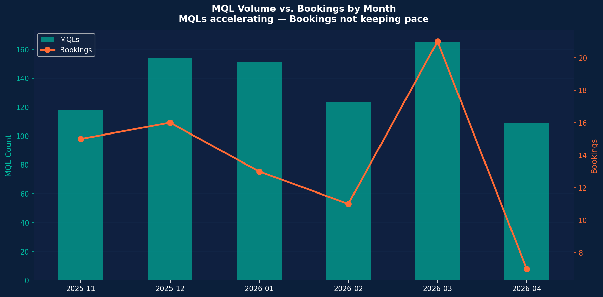
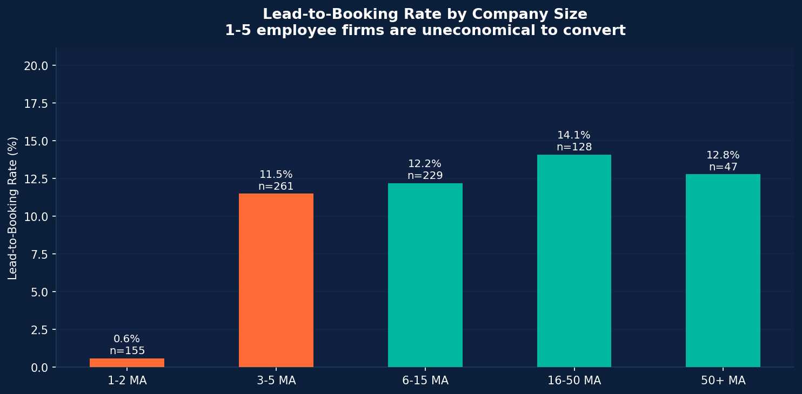
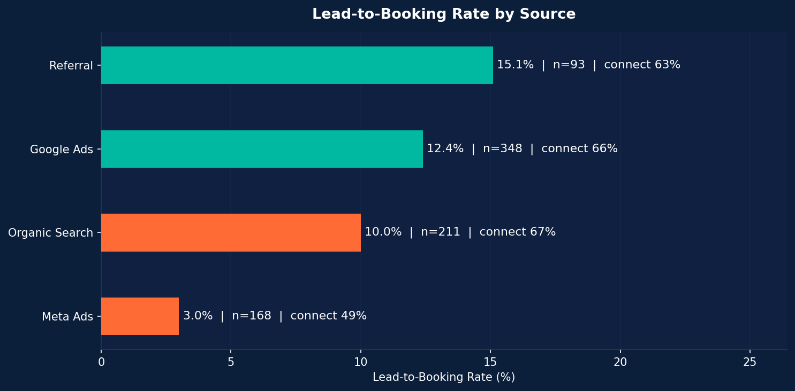
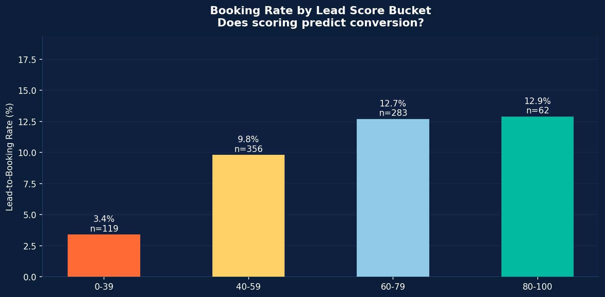
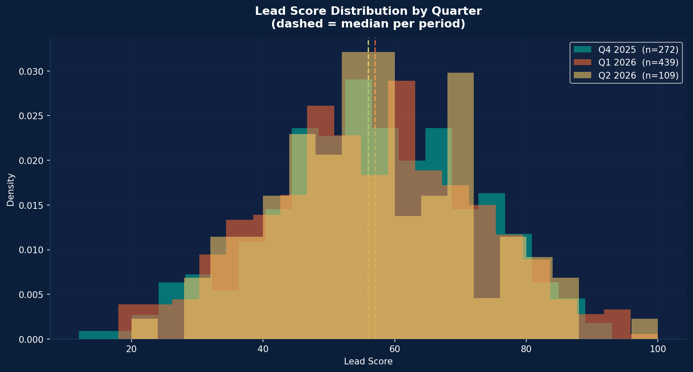

# HERO Software — GTM Funnel Analysis
**Senior GTM Analyst Case Study | Jun 2026**

---

## Executive Summary

Three data points tell the whole story:

1. **PV's share of Marketing's MQL pool exploded from 34% → 58% between Q4 2025 and Q2 2026.** PV leads convert at 1.6% — versus 21.6% for SHK and 21.0% for Elektro. Marketing is filling the funnel with leads the product isn't built to win yet.

2. **Response time matters — but mostly for the good leads.** Within core trades (SHK + Elektro), leads touched within 2h book at 28.8% vs 4.5% when touched after 24h. The catch: 80% of all slow-touched leads are PV, and PV doesn't convert at *any* speed (0% even when touched ≤2h). SDRs are already triaging PV down (1.75 calls vs 4.25 for SHK) — so the response-time lever is real but worth **~€38k of recoverable ARR, not the €260k a naive read suggests.**

3. **Meta Ads generates 20% of MQLs but only 6% of Bookings.** Its 3.0% booking rate and 18.5% demo-to-close rate are both less than half of every other channel. It is subsidising volume, not revenue.

**The verdict:** Sales is not wrong about lead quality — and Sales is mostly *already* triaging correctly. The dominant lever is the top of the funnel: fix the PV ICP filter first (highest-impact), then tighten the response SLA on core-trade leads (smaller, but a clean quick win). Note: PV is not worthless — its few deals are the *largest* (ø €7.9k), so the fix is to gate *early-stage* PV, not abandon the trade.

---

## Part 1 — Diagnose the Funnel

### 1.1 The Overall Funnel

| Stage | Count | Step Conv. | End-to-End |
|---|---|---|---|
| MQLs | 820 | — | 100% |
| Connects | 512 | 62.4% | 62.4% |
| Demos | 196 | 38.3% | 23.9% |
| Bookings | 83 | 42.3% | **10.1%** |

The funnel has two major leakage points: **MQL → Connect** (37.6% of leads never picked up the phone) and **Connect → Demo** (only 38% of connected leads reach a demo). The Demo → Booking rate (42%) is healthy, meaning the product itself closes well once the right person sees it.

---

### 1.2 Where Exactly Does the Funnel Break?

#### By Trade — the clearest signal

| Trade | MQLs | Connect % | Demo % | Booking % | Demo→Bk % |
|---|---|---|---|---|---|
| SHK | 176 | 85.2% | 41.5% | **21.6%** | 52.1% |
| Elektro | 143 | 85.3% | 45.5% | **21.0%** | 46.2% |
| Maler | 52 | 65.4% | 21.2% | 7.7% | 36.4% |
| Dachdecker | 67 | 79.1% | 31.3% | 7.5% | 23.8% |
| **PV** | **382** | **40.1%** | **6.8%** | **1.6%** | 23.1% |

PV is not a funnel problem — it is a product-market fit problem at the top of funnel. PV leads refuse to pick up (40% connect rate vs 85% for SHK/Elektro), almost never reach a demo (7% vs 42%), and book at 1.6%. The product closes fine when it gets there (23% demo→bk), but almost no PV lead should be in the funnel at its current stage.

#### But weight it by revenue before declaring PV worthless

A count-based view says "PV converts at 1.6%, kill it." A revenue-weighted view is more nuanced — and this distinction matters for the recommendation:

| Trade | Bookings | Booked Revenue | Avg Deal | Share of Revenue |
|---|---|---|---|---|
| SHK | 38 | €217,442 | €5,722 | 44% |
| Elektro | 30 | €194,118 | €6,471 | 39% |
| **PV** | **6** | **€47,140** | **€7,857** ← highest | 10% |
| Dachdecker | 5 | €21,476 | €4,295 | 4% |
| Maler | 4 | €14,829 | €3,707 | 3% |

Total booked revenue across the period: **€495,005.** PV converts rarely, but the PV deals that *do* close are the **largest of any trade** (ø €7,857, +37% vs average). That is the signature of a high-value segment with a **stage/fit filter problem**, not a worthless one. The action is therefore *not* "stop selling to PV" — it is "stop letting early-stage, sub-scale PV leads into the SDR queue, and keep the qualified ones." SHK + Elektro remain 83% of revenue and are where the reliable book is.

#### By Period — the degradation timeline

| Quarter | MQLs | PV Share | Booking % |
|---|---|---|---|
| Q4 2025 | 272 | 33.8% | **11.4%** |
| Q1 2026 | 439 | 51.7% | **10.3%** |
| Q2 2026 | 109 | 57.8% | **6.4%** |

As PV's share of the MQL pool grew from 34% to 58%, overall booking rate fell from 11.4% to 6.4%. This is a direct arithmetic consequence. There is no mystery here.

#### By Company Size

| Size | MQLs | Booking % | Demo→Bk % |
|---|---|---|---|
| 1-2 MA | 155 | **0.6%** | 4.5% |
| 3-5 MA | 261 | 11.5% | 40.0% |
| 6-15 MA | 229 | 12.2% | 54.9% |
| 16-50 MA | 128 | 14.1% | 54.5% |
| 50+ MA | 47 | 12.8% | 40.0% |

1-2 employee shops are effectively unconvertible: 155 MQLs produced one booking. They are reaching demo stage (14% demo rate) but the demo-to-close rate (4.5%) is near zero — the product is priced and positioned for teams, not solo operators. This segment overlaps heavily with PV (early-stage PV installers are often 1-2 MA).

#### By Lead Source

| Source | MQLs | Booking % | Demo→Bk % | Avg Deal (€) |
|---|---|---|---|---|
| Referral | 93 | **15.1%** | 50.0% | 6,056 |
| Google Ads | 348 | 12.4% | 47.8% | 5,789 |
| Organic Search | 211 | 10.0% | 41.2% | 6,567 |
| **Meta Ads** | **168** | **3.0%** | **18.5%** | 4,676 |

Meta Ads is structurally different from all other sources. Its connect rate (48.8% vs 65–67%), demo rate (16%), and demo-to-close rate (18.5%) are all less than half the field. Meta is generating awareness clicks — not purchase intent. The CPL looks stable because it is measuring the wrong thing.

#### By Lead Score — the model is broken

| Score Bucket | MQLs | Booking % |
|---|---|---|
| 0-39 | 119 | 3.4% |
| 40-59 | 356 | 9.8% |
| 60-79 | 283 | 12.7% |
| 80-100 | 62 | 12.9% |

The scoring model provides mild signal (3.4% vs 12.9% between extremes), but the median score is **identical across all three quarters** (56–57). The model did not detect the quality degradation caused by the PV influx. This means lead scoring is currently useless as a filtering mechanism because it can't distinguish a high-intent SHK lead from a curious PV installer.

---

### 1.3 The Three Hypotheses

#### H1 — Lead Quality Degradation (Primary Driver)
> *Marketing's PV campaign scaled a segment that is not ICP-ready, diluting the entire funnel.*

**Evidence:**
- PV grew from 34% → 58% of MQL pool in two quarters
- PV booking rate = 1.6%; SHK/Elektro = 21%+
- 40% connect rate for PV vs 85% for core trades → PV leads don't answer because they didn't raise their hand for HERO's product
- Transcript analysis: 50% of PV DQs are "business too early-stage," "product confusion," or "too small"
- Lead score model did not catch this shift → scoring urgently needs a PV-aware feature

**Strength: High. This is the smoking gun.**

#### H2 — SDR Response-Time Gap (Real, but smaller than it first appears)
> *Slow follow-up wastes good leads — but most slow follow-up is rational triage of bad ones.*

The raw signal looks dramatic — booking rate falls monotonically with response time:

| Time Bucket | MQLs | Booking % |
|---|---|---|
| ≤2h | 214 | **20.1%** |
| 2-4h | 108 | 15.7% |
| 4-8h | 105 | 7.6% |
| 8-24h | 146 | 6.2% |
| 24-48h | 118 | 3.4% |
| 48h+ | 129 | **1.6%** |

**⚠️ But this is heavily confounded with trade.** PV's mean time-to-touch is **50.7 hours** vs 8–12h for SHK/Elektro. Of the 247 leads touched after 24h, **80% are PV** — and PV doesn't convert at *any* speed. Breaking booking rate out by trade × speed shows the truth:

| Trade | Fast (≤2h) | Mid (2-24h) | Slow (>24h) |
|---|---|---|---|
| SHK | 28.9% | 19.2% | 4.5% |
| Elektro | 28.6% | 16.2% | 14.3% |
| **PV** | **0.0%** | **2.1%** | **1.5%** |

Two things follow:
1. **Response time genuinely matters for core trades** — SHK ≤2h books at 28.9% vs 4.5% slow. That effect is real and worth fixing.
2. **For PV, speed changes nothing** — fast or slow, PV books at ~0–2%. So most of the "slow response" volume is SDRs *correctly deprioritizing* leads they already know won't close. The SDR effort data confirms this: PV gets **1.75 call attempts** vs **4.25 for SHK** — they're triaging, not neglecting.

**Honest sizing of the prize.** Restricting to core trades (SHK + Elektro), only **29 leads** were touched late (>24h). If those had been touched ≤2h at the core fast-rate of 28.8%, we'd recover ~6 bookings. At an avg core deal of €6,052, that's **~€38k of recoverable ARR — not the ~€260k a naive, confounded read implies.** Still worth a quick SLA fix, but it is not the main event.

**Strength: Moderate. Directionally real for core trades; the headline number must be trade-adjusted or it overstates the prize ~7×.**

#### H3 — Demo Quality / Weak Qualification (Secondary)
> *SDRs push marginal leads to demo to hit activity metrics, wasting AE time.*

**Evidence:**
- Overall demo-to-booking rate is 42% (healthy)
- But Q2 2026 demo-to-booking rate dropped to 30% vs Q4 2025 at 41%
- 1-2 MA segment reaches demos at 14% rate but closes at 4.5% — someone is booking demos that shouldn't be booked

**Strength: Moderate. Real, but secondary to H1 and H2.**

---

### 1.4 Priority: Which Hypothesis to Tackle First?

| Hypothesis | Revenue Impact | Implementation Effort | Speed |
|---|---|---|---|
| H1: PV ICP filter | **Very High** (47% of MQL pool, the dominant lever) | Medium (MQL criteria, scoring model, ad targeting) | 4-6 weeks |
| H2: Response SLA (core trades) | **Low–Moderate** (~€38k recoverable ARR) | Low (CRM routing, SDR dashboard) | 1-2 weeks |
| H3: Demo gates | Medium | Low (pre-demo checklist) | 2-3 weeks |

**Tackle H1 — it is the lever.** Redefining what counts as a (PV) MQL and redirecting Meta Ads spend is where the real volume is. This requires Marketing buy-in but moves the number.  
**Run H2 in parallel as a quick win** — a 2-hour SLA on *core-trade* leads is a 2-week, zero-conflict implementation. It won't move the headline rate much (~€38k), but it builds credibility and proves the analytics function ships. Do not oversell it to the CRO as the fix — that would not survive scrutiny.

---

### 1.5 The Truth: Who Is Right — Sales or Marketing?

> *"Sales blames lead quality. Marketing says Sales isn't converting. We need to know the truth."*

**Both sides are right. Both sides are wrong. About different segments.**

#### What the data says about Sales' complaint

Sales says lead quality is bad. Look at PV: 40% connect rate, 6.8% demo rate, 1.6% booking rate — 382 leads that mostly don't pick up the phone and aren't ready to buy. **Sales is correct about PV.**

But look at SHK and Elektro: 85% connect rate, 21%+ booking rate, 42–52% demo-to-close. **Sales is wrong to apply the PV complaint to all leads.** Core-trade leads are good and closing at a healthy rate. Sales is taking a real and legitimate problem and overclaiming it as universal.

#### What the data says about Marketing's complaint

Marketing says Sales isn't converting. Within SHK + Elektro, leads touched within 2h convert at 28.9% vs 4.5% after 24h — a real execution gap exists. **Marketing has a point.**

But SDRs already give PV **1.75 call attempts vs 4.25 for SHK**. The slow response Marketing is observing on PV leads is not negligence — it is rational triage of leads that don't pick up and don't buy. And the overall demo-to-booking rate is 42% — **when Sales gets a qualified lead to demo, they close it.** Marketing is mistaking correct prioritisation for underperformance.

#### The truth in one sentence

> **Neither team is the problem. Marketing scaled a segment (PV) the product isn't ready to win yet, without updating the ICP or MQL definition — and no feedback loop existed between the two teams to catch it.**

The real culprit is a missing process: no shared definition of what a qualified lead looks like, no signal flowing from Sales DQ reasons back to Marketing channel decisions, and no RevOps guardrail preventing PV volume from flooding the SDR queue.

#### How to say this in the room

When the CRO asks "who's right?":

> *"Both — but about different segments. Sales is right that PV leads are unworkable, and the data shows they already know it: they're giving PV half the call attempts they give SHK. Marketing is right that core-trade leads can be converted — SHK and Elektro book at 21%, which is strong. The conflict exists because both teams are looking at the same funnel but seeing different segments. The fix isn't behavioral on either side. It's structural: redefine what counts as a PV MQL, replace CPL with Cost-per-Booking as the channel metric, and build a DQ feedback loop from CRM to Marketing. The fight disappears when both teams are optimising for the same outcome."*

---

## Part 2 — The Creative Lever: Transcript Intelligence

### 2.1 The Problem with the Current State

20 call transcripts are being archived and forgotten. They contain real customer language, exact objection phrases, competitive intelligence, and product-market-fit signals — none of which are being fed back into Marketing targeting, lead scoring, or SDR playbooks.

### 2.2 The Framework: Disqualification Intelligence Loop

**Step 1 — Structured tagging on every call disposition**

When an SDR marks a lead as DQ, they tag:
- `dq_category`: [Timing | Wrong-Fit | Competitor | Price | Product Gap | Process]
- `objection_verbatim`: one sentence in customer's words
- `business_stage`: [pre-software | active evaluation | post-switch | incumbent]
- `urgency_horizon`: [now | 3-6 months | 12 months+ | never]

This takes 30 seconds per call and runs inside the existing CRM.

**Step 2 — Weekly DQ digest back to Marketing and RevOps**

A simple dashboard (Looker / Google Sheets) shows:
- DQ category breakdown by source → tells Marketing which channels bring wrong-fit leads
- DQ category breakdown by trade → surfaces product-market fit gaps by segment
- Trending objections this week vs last week → early warning for market shifts

**Step 3 — Objection → ICP refinement loop**

When a DQ pattern spikes (e.g., "wrong expectations about PV features"), it triggers:
- Marketing: update ad creative/landing page copy to set correct expectations
- Sales: update the SDR qualification script with a new disqualifying question
- RevOps: add the signal to the lead score model as a negative input

### 2.3 Concrete Example Output 1 — Lead Source Contamination Map (for Marketing)

Built from current 20-transcript sample (would use full CRM DQ data in production):

| Source | Primary DQ Pattern | % of DQs | Implication | Action |
|---|---|---|---|---|
| Meta Ads | "Nur Info" / "Falsche Erwartung" (product confusion) | ~45% | Meta attracts curiosity, not intent | Show actual product UI in ads; add "for teams of 5+" in copy |
| Google Ads | "Kein Bedarf jetzt" / "Will nur vergleichen" | ~30% | Keyword intent too broad | Add negative keywords: "Was ist", "kostenlos", "Alternative"; create comparison pages |
| Organic | "Wettbewerber" (PlanCraft, streit.net) | ~20% | Organic reaches later-stage evaluators who are locked in | Create head-to-head comparison landing pages; target "PlanCraft Alternative" keyword cluster |

**Business value:** Marketing stops spending on creative for bottom-of-funnel Meta Ads that produce 3% booking rates. One strategic reallocation could shift 168 Meta leads → channels converting at 10-15%.

### 2.4 Concrete Example Output 2 — Objection Response Playbook (for Sales)

Extracted from actual transcripts, organized by frequency:

| Objection Type | Customer Quote | SDR Response Upgrade | Qualifying Next Step |
|---|---|---|---|
| Business too early (PV) | "Wir haben jetzt erst angefangen mit PV-Aufträgen" (T001) | "Verstehe — ab wie vielen PV-Aufträgen im Monat macht Software für Sie Sinn?" — if < 5/month → DQ immediately, set 6-month callback | DQ if < 5 PV jobs/month → move to nurture sequence |
| Excel works fine | "Wir machen das noch mit Excel, das läuft" (T003, T014) | "Wie viele Stunden pro Woche verbringt Ihr Team mit Angeboten und Abrechnungen?" → ROI anchor on time cost | Book only if ≥ 6h/week admin time → demo worthy |
| PlanCraft is cheaper | "PlanCraft kostet weniger pro Nutzer" (T012) | "Was zahlen Sie aktuell, alles inklusive — Support, Updates, Add-ons?" + position on integration depth | Ask for current annual total cost before discussing HERO pricing |
| Product confusion (PV) | "Ich dachte das ist eher für SHK gedacht" (T006) | Pre-call: send a PV-specific one-pager before the call. On call: open with PV customer case study | If objection persists → DQ (wrong-fit) |
| Wrong contact reached | "Das war die Sekretärin" / "Ich bin nur der Lehrling" (T018, T019) | Immediately ask: "Wer trifft die Entscheidung für Software in Ihrem Betrieb?" before pitching anything | Re-route immediately; don't continue pitch |

**Business value:** Even if DQ rate doesn't drop, SDR time-per-DQ drops by 40% by cutting calls short on confirmed non-ICP signals. AE demos become higher quality because SDRs disqualify earlier.

### 2.5 Scale Path

| Phase | What | When |
|---|---|---|
| Now | Manual tagging by SDRs in CRM; weekly summary to Marketing | Week 1 |
| Month 2 | Automated DQ category suggestion from call notes (keyword rules) | Month 2 |
| Month 3 | LLM-based classifier on call notes → structured output → auto-feed into lead score | Month 3 |
| Month 6 | Weekly "Voice of the Lost Lead" digest sent to CMO, CRO, Product | Ongoing |

---

## Part 3 — The Action Plan

### 3.1 Stakeholder Sequence

**Day 1-3 — RevOps**
Before talking to anyone else, validate the data.
- Confirm: Is `demos_completed` logged consistently across all SDRs, or are some SDRs skipping it?
- Confirm: Is `connected_calls` the same definition across CRM users?
- Confirm: How does PV show up in lead source attribution — are these all truly organic PV leads or campaign-specific?
- Ask RevOps to pull a CRM export of all leads with DQ reason for the last 6 months → this will fill the gap the 20-transcript sample can't cover.

**Day 4-6 — Sales Leadership (SDR Manager / Head of Sales)**
Frame this as "where can we unlock capacity" — not "Sales is underperforming."

Key message: *"30% of your SDR time is going to PV leads that connect at 40% and almost never demo. Here's what the data says — and here's a simple response-SLA that would immediately recover bookings on the good leads."*

Share: Time-to-touch chart. Frame the 2-hour SLA as a revenue unlock, not a behavioral criticism.

Agree on: (1) a 2-hour response SLA starting next week, (2) a trial pre-qualification filter for PV leads.

**Day 7-10 — Marketing**
Frame this as "CPL is misleading us — here's the real cost of acquisition that matters."

Key message: *"Meta Ads is generating 20% of MQLs at 3% booking rate — we're paying for leads that will never close. Google Ads and Organic at 10-12% are our real funnel. PV creative specifically is bringing in early-stage operators who aren't software-ready yet."*

Share: Source conversion waterfall + PV trade-mix shift. Propose:
- Pause or retarget Meta Ads PV creative immediately
- Add a company size qualifier (6+ employees) to PV ad forms
- Create a "PV Starter Guide" lead magnet to capture early-stage PV leads into nurture instead of direct-to-SDR

**Week 2 — CRO + CEO**
Present the full picture with this 2-slide summary:
- Slide 1: The PV dilution math — one chart showing trade mix shift + booking rate by trade. The arithmetic is undeniable.
- Slide 2: The two fixes — (a) PV ICP gate, (b) 2-hour SLA — with projected bookings impact.

Proposed ask: Approval to redefine MQL criteria to gate PV leads at ≥6 employees AND ≥5 PV jobs/month, and pause Meta Ads PV campaign for 30 days as an experiment.

---

### 3.2 How to Measure Success

**Primary Metric:** Lead-to-Booking Conversion Rate
- Baseline: 10.1% overall; 6.4% in Q2 2026
- 4-week target: ≥12.0% (achieved by eliminating the lowest-converting lead pool segments)
- 8-week target: ≥14.0% (achieved as SDR response SLA takes effect)

**Secondary Metrics by Fix:**

| Fix | Metric | Baseline | 4-Week Target | Owner |
|---|---|---|---|---|
| PV ICP gate | % of MQLs that are PV with ≤5 MA | ~25% of pool | < 10% | Marketing |
| PV ICP gate | PV booking rate | 1.6% | > 5% (better-filtered PV leads) | RevOps |
| 2h SLA (core trades) | % of SHK/Elektro leads touched within 2h | ~41% | > 80% | SDR Manager |
| 2h SLA (core trades) | Booking rate for core ≤2h leads | 28.8% | Hold or improve | SDR Manager |
| Meta Ads pause | Meta MQL volume | 168/period | Target 0 for 30 days | Marketing |
| Meta Ads pause | Overall booking rate | 10.1% | > 12.0% | RevOps |
| DQ tagging | % of DQs with structured reason | ~5% | > 80% | RevOps |

**Confirmation threshold:** If overall booking rate is ≥12% after 4 weeks AND PV booking rate improves to ≥5% (for gated PV leads), H1 is confirmed. If not, escalate investigation to H3 (demo quality gate).

---

### 3.3 What If the Hypothesis Doesn't Hold After 4 Weeks?

**If booking rate doesn't improve despite better PV filtering:**
→ H3 becomes the focus. Implement a pre-demo qualification checklist: company size ≥ 6 employees, ≥ 5 jobs/month, decision-maker confirmed on call. Track demo-to-close rate weekly. If demo-to-close rate improves but MQL-to-demo rate drops, we've tightened qualification correctly.

**If booking rate improves but not enough:**
→ H2 (response SLA) was not implemented correctly. Audit SDR follow-up timestamps in CRM. Identify which SDRs are systematic outliers. Consider automated lead assignment with a CRM rule that reassigns a lead if not touched within 90 minutes.

**If PV booking rate stays at 1.6% even with better filtering:**
→ Product gap. The transcripts surface one clear signal: PV installers expect PV-specific features (Auslegungssoftware, VDE protocols, PV-specific proposal templates). This is a Product conversation — flag to CPO with data from the DQ reason breakdown. In the meantime, pause *early-stage / sub-scale* PV acquisition (the segment that never converts) — but keep pursuing qualified PV, since those deals are the largest in the book (ø €7,857). Don't throw out the high-value segment with the unqualified volume.

**Standing rule:** Weekly metric review for the first 8 weeks. No 4-week "wait and see" — if the leading indicators (demo rate, connect rate by trade) are not moving in week 2, course-correct in week 3.

---

## Appendix: Key Numbers at a Glance

| Metric | Value |
|---|---|
| Total MQLs | 820 |
| Overall Booking Rate | 10.1% |
| PV Booking Rate | 1.6% |
| SHK Booking Rate | 21.6% |
| Elektro Booking Rate | 21.0% |
| PV Share Q4 2025 | 33.8% |
| PV Share Q2 2026 | 57.8% |
| ≤2h Touch Booking Rate | 20.1% |
| 48h+ Touch Booking Rate | 1.6% |
| Meta Ads Booking Rate | 3.0% |
| Referral Booking Rate | 15.1% |
| Avg Deal Size (all) | ~€5,964 (€495,005 / 83) |
| Avg Deal Size PV | €7,857 (highest of any trade) |
| Total Booked Revenue | €495,005 |
| Recoverable ARR from response-time fix (core trades, trade-adjusted) | ~€38,000 |
| PV share of slow-touched (>24h) leads | 80% |
| SDR call attempts: PV vs SHK | 1.75 vs 4.25 (SDRs already triage) |

> Charts embedded above from `analysis/charts/` | Reproducible data script: `analysis/funnel_analysis.py`
