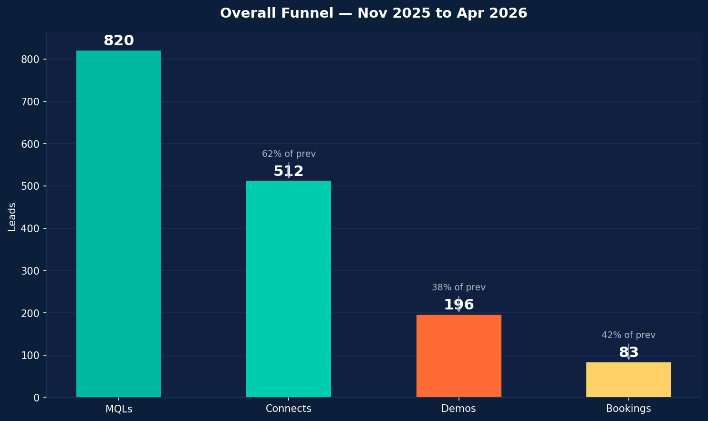
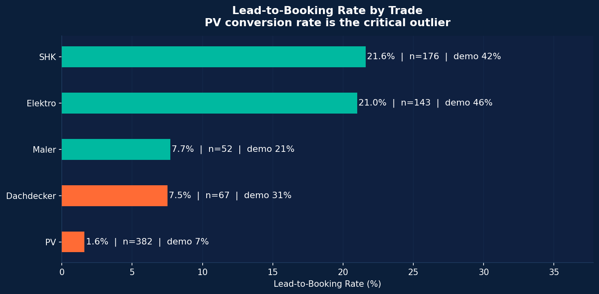
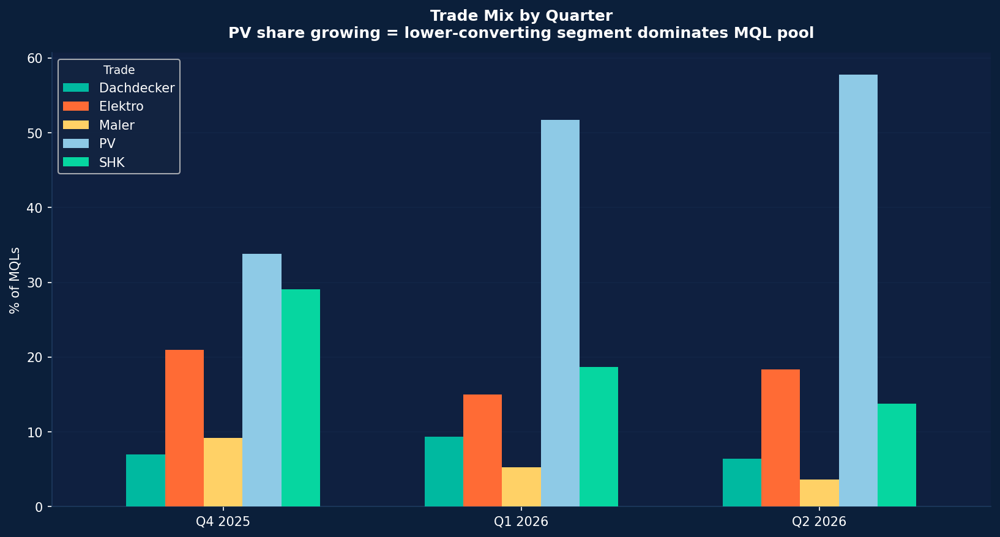
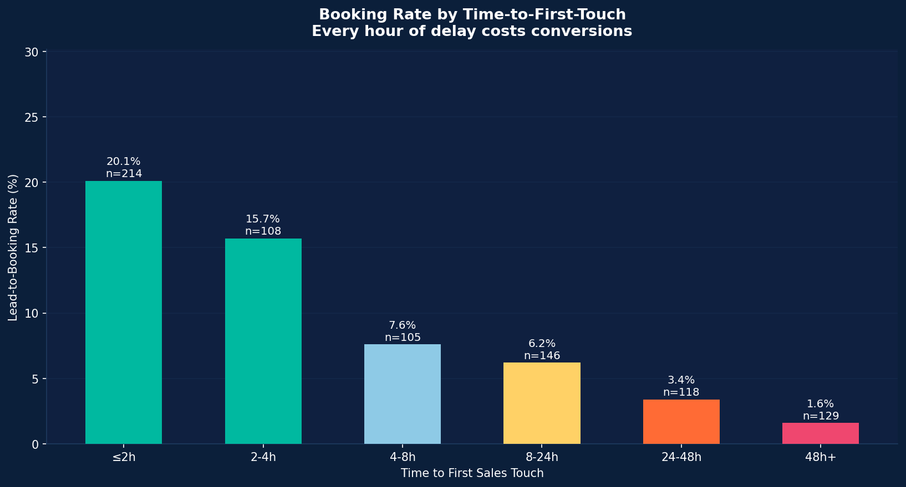
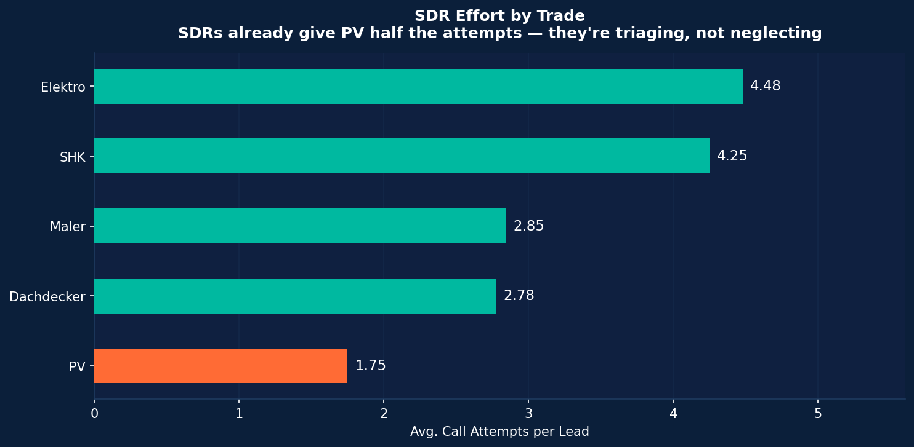
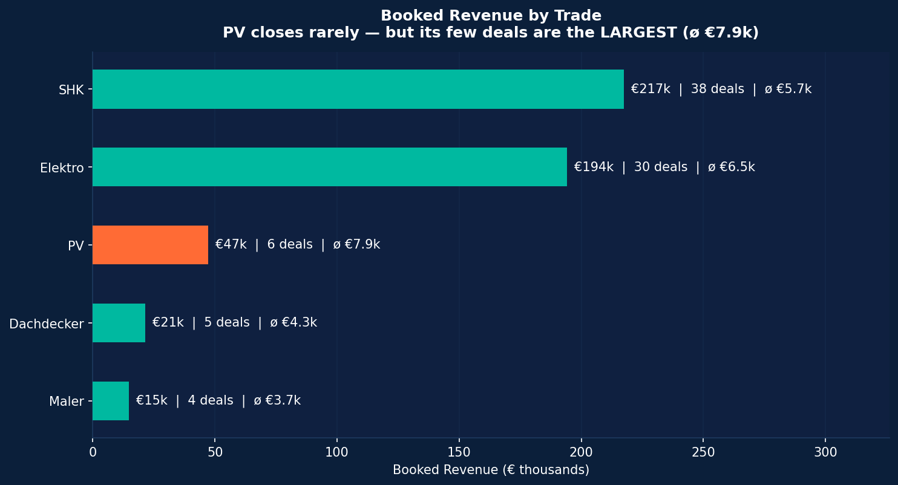
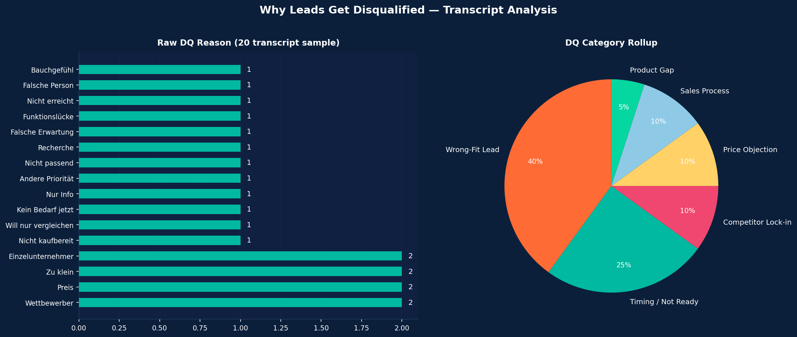

# HERO Software GTM Funnel Analysis
### [Rodrigo Uehara Guskuma](https://www.linkedin.com/in/rodrigo-guskuma/) | Senior GTM Analyst Case Study

For more details about the code, access the link below: [github.com/ugrodrigo/hero-software-case-rodrigo-uehara-guskuma](https://github.com/ugrodrigo/hero-software-case-rodrigo-uehara-guskuma)

---

## Data Caveats

1. **The +38%/+9% MQL and Bookings baselines aren't in the data.** Q3 2025 is missing; Q2 2026 is April only. I can't reproduce those exact figures. Within the window I have, MQL growth is +61% QoQ and cohort conversion fell from 11.4% → 10.3% same directional story, can't validate the headline numbers.

2. **Q2 2026 is a partial quarter.** The 6.4% booking rate is understated April leads haven't finished converting. Treat it as a leading indicator, not a final result.

3. **87.8% of leads have no outcome label.** 720 leads are neither booked nor in the DQ transcripts. The 10.1% booking rate assumes "no booking = lost." First RevOps conversation should clarify how many are still in active pipeline.

---

## Opening: The Truth

> *"Sales blames lead quality. Marketing says Sales isn't converting. We need to know the truth."*

**Both sides are right, but about different segments.**

- Sales is correct that PV leads are unworkable (1.6% booking rate, 40% connect rate). But wrong to generalise it to all leads.
- Marketing is correct that core-trade leads can be converted (SHK + Elektro at 21%+). But wrong to call it a Sales execution failure, SDRs already deprioritise PV on purpose (1.75 calls vs 4.25 for SHK).

**The truth:** Neither team is the problem. Marketing scaled PV without updating the ICP, and no feedback loop existed to catch it.

PV leads were counted the same as an SHK lead, same score, same routing to SDRs, same funnel treatment, even though PV businesses behave completely differently.

---

## Task 1 — Diagnose the Funnel

### Where exactly does the funnel break?

**Overall funnel (820 leads, Nov 2025 – Apr 2026):**

| Stage | Count | Step Conv. | End-to-End |
|---|---|---|---|
| MQLs | 820 | — | 100% |
| Connects | 512 | 62.4% | 62.4% |
| Demos | 196 | 38.3% | 23.9% |
| Bookings | 83 | **42.3%** | **10.1%** |

Two leakage points: **MQL → Connect** (37.6% never pick up) and **Connect → Demo** (only 38% reach a demo). Demo → Booking at 42% is healthy, the product closes well when the right person sees it.

**But the break is not uniform.** Cut by trade and a very different picture comes up:

| Trade | MQLs | Connect % | Demo % | Booking % |
|---|---|---|---|---|
| SHK | 176 | 85% | 42% | **21.6%** |
| Elektro | 143 | 85% | 46% | **21.0%** |
| PV | **382** | **40%** | **7%** | **1.6%** |

The funnel breaks almost entirely **at the top, inside the PV segment.** PV leads don't pick up (low connect), don't demo (low intent), and rarely buy. The rest of the funnel is performing well.

---

### What are the 2–3 most likely root causes?

#### H1 — ICP Mismatch (Primary)
> *Marketing scaled a segment (PV) the product isn't ready to win yet.*

**Evidence:**
- PV grew from **34% → 58%** of MQLs between Q4 2025 and Q2 2026
- As PV share rose, overall booking rate fell from **11.4% → 6.4%** this is a direct consequence of the mix shift.

- Transcripts confirm why: PV leads are too early-stage ("we just started doing PV"), too small (1–2 person shops), or confused about the product ("I thought this was for SHK")
- Lead score didn't catch it, median score flat at 56–57 across all quarters despite PV flooding the pool

**Hypothesis Strength: High, the main driver.**

---

#### H2 — Response-Time Gap on Core Trades
> *Fast follow-up on good leads is being missed.*

Some SHK and Elektro leads worth calling, are waiting too long before anyone reaches out, and by then they've gone cold, talked to a competitor, or just lost interest.

Within SHK + Elektro only:

| Touch Speed | Booking Rate |
|---|---|
| ≤ 2 hours | **28.8%** |
| > 24 hours | **4.5%** |

**Caveat:** 80% of slow-touched leads are PV, SDRs aren't neglecting good leads, they're correctly triaging bad ones. The response-time lever applies to **core-trade leads only**, where currently ~€38k is being left on the table every 6 months (based on the current data) by not having a 2-hour response SLA on core-trade leads. That's the recurring cost of not fixing it and it might take two weeks to fix.

**Hypothesis Strength: Moderate. Real for core trades, but not the headline number.**

---

#### H3 — Demo Quality Degradation (Secondary)
> *Wrong leads reaching demo stage waste AE time.*

- Q2 2026 demo-to-booking rate dropped to **30%** vs 41% in Q4 2025
- 1–2 MA segment reaches demos at 14% rate but closes at only 4.5% unqualified leads slipping through

Micro-businesses are somehow making it through to the demo stage (14% demo rate) but almost never buying (4.5% close rate), because the product is priced and built for teams, not solo operators running everything alone.

The transcript makes this explicit:

>"Wir sind nur zu zweit — ich und mein Geselle" (T016) — "It's just me and my apprentice, we do 2-3 PV installations a month. I don't need management software for that."

**Hypothesis Strength: Moderate. Real but secondary, prioritize H1 first.**

---

### Which hypothesis first? (Impact × Feasibility)

| Hypothesis | Revenue Impact | Effort | Speed |
|---|---|---|---|
| **H1: PV ICP filter** | **Very High** — fixes 47% of MQL pool | Medium | 4–6 weeks |
| H2: Core-trade SLA | Low–Moderate (~€38k) | Low | 1–2 weeks |
| H3: Demo gates | Medium | Low | 2–3 weeks |

**H1 first** — it's the lever. The entire funnel degradation traces back to PV dilution. Everything else is noise by comparison.

**H2 in parallel** — a 2-week quick win that builds credibility without waiting for H1 to land. Don't oversell the revenue impact.

**Important nuance:** PV is not worthless, its deals are the **largest of any trade (ø €7,857)**. The fix is to gate *early-stage / sub-scale* PV, not abandon the segment.

---

## Task 2 — The Creative Lever

### The problem with the current state

20 call transcripts are filed and forgotten. They contain exact customer language, objection patterns, competitive intelligence, and ICP signals, none of which feed back into Marketing targeting, lead scoring, or Sales playbooks.

### The framework: Disqualification Intelligence Loop

**Conceptual sketch — three steps:**

**Step 1 — Tag every DQ call** (30 seconds in CRM):
- `dq_category`: Timing | Wrong-Fit | Competitor | Price | Product Gap | Process
- `objection_verbatim`: one sentence in the customer's words
- `urgency_horizon`: now | 3–6 months | 12 months+ | never

**Step 2 — Weekly DQ digest** (auto-built from CRM tags):
- DQ breakdown by source → Marketing sees which channels bring wrong-fit leads
- DQ breakdown by trade → surfaces product-market fit gaps per segment
- Trending objections week-over-week → early warning for market shifts

**Step 3 — Close the loop:**
- Marketing: adjust creative/targeting based on DQ patterns
- Sales: update qualification scripts with disqualifying questions
- RevOps: feed DQ signals into lead score as negative inputs

**Scale path:** Manual CRM tags (Week 1) → keyword classifier on call notes (Month 2) → LLM tagger auto-feeding lead score (Month 3)

---

### AI-Augmented Scale Path

The manual loop works on day one. AI is what makes it cover **every call instead of a 20-row sample** — and it unlocks something no manual process can: scoring the past.

**1. Retroactive backfill — the highest-value move.**
87.8% of leads (720) have no outcome label. If those calls were recorded, an LLM can mine *all* historical transcripts — not just the 20 sampled — and assign `dq_category` + `urgency_horizon` to leads that are currently invisible. Every "3–6 months" DQ becomes a re-engagement list. This re-lights dead pipeline retroactively; no manual tagging can.

**2. Real-time extraction at scale.**
Call recording → transcription (Whisper) → LLM pulls the three structured fields → auto-feeds the weekly digest *and* the lead score. Removes the dependency on SDRs remembering to tag — the weak point of any manual process. German call data is well within modern LLM capability.

**3. Sub-scale / early-stage PV detector at MQL entry (the H1 lever).**
The whole diagnosis is "Marketing scaled PV without updating the ICP." An LLM scoring inbound lead context against the *real* ICP can flag "early-stage PV" or "1–2 MA" **before** an SDR is ever assigned — fixing the problem upstream.

**Guardrails (why this is safe):**

- `objection_verbatim` is **extracted, never generated** — pull the customer's actual sentence, never let the model paraphrase, or the Marketing signal gets poisoned with hallucinated language.
- Weekly human spot-check on a sample until classification accuracy is trusted.
- AI changes the *cost and speed* of the loop, not its logic — the value holds with or without it.

> **One-liner:** *"The loop works manually on day one. AI is what makes it cover every call instead of a sample — and it lets us retroactively score the 720 leads we currently can't see."*

---

### Concrete Output 1 — For Marketing: Source Contamination Map

| Source | Primary DQ Pattern | Implication | Action |
|---|---|---|---|
| Meta Ads | "Nur Info" / "Falsche Erwartung" — product confusion | Meta attracts curiosity, not intent | Show product UI in ads; add "for teams of 5+" in copy |
| Google Ads | "Kein Bedarf jetzt" / "Will nur vergleichen" | Keywords too broad | Add negative keywords: "Was ist", "kostenlos"; create comparison pages |
| Organic | "Wettbewerber" — PlanCraft, streit.net | Reaches later-stage evaluators already locked in | Build "PlanCraft Alternative" landing pages |

**Why this goes beyond the obvious:** Instead of using transcripts to coach reps on objection handling (the standard play), this routes the signal *upstream* to Marketing — changing who enters the funnel before Sales ever sees them.

---

### Concrete Output 2 — For Sales: Early-Kill Qualification Script

Built from actual transcript language — questions that detect unworkable leads in the first 60 seconds:

| Signal in transcript | Qualifying question | Decision rule |
|---|---|---|
| "Wir haben erst angefangen mit PV" | "Ab wie vielen PV-Aufträgen im Monat macht Software Sinn für Sie?" | < 5/month → DQ, 6-month callback |
| "Wir machen das mit Excel" | "Wie viele Stunden pro Woche verbringt Ihr Team mit Angeboten?" | < 6h/week → DQ |
| "Ich bin nur der Lehrling / die Sekretärin" | "Wer trifft die Entscheidung für Software?" | Not DM → re-route immediately, don't pitch |
| "PlanCraft kostet weniger" | "Was zahlen Sie aktuell — alles inklusive?" | Get total cost before discussing HERO pricing |

**Why this goes beyond the obvious:** The goal isn't to handle objections better — it's to surface them in the first 60 seconds and DQ faster. Shorter bad calls free up SDR capacity for good ones.

---

## Task 3 — The Action Plan

### Who to talk to first — and in what order

**Day 1–3 — RevOps (first, always)**

Validate before presenting to anyone. Key questions:
- Is `demos_completed` logged consistently across all SDRs?
- Is `dq_reason` a real CRM field, or are the 20 transcripts the only record?
- What feeds the lead score model — is trade or company size even a variable?

Don't share findings with Sales or Marketing until RevOps confirms the data is trustworthy.

**Day 4–6 — Sales leadership**

Frame as capacity unlock, not criticism:
> *"30% of SDR time goes to PV leads with a 40% connect rate. Here's how to protect your reps' time and focus them where they win."*

Share: SDR effort chart + core-trade response-time finding. Agree on a 2h SLA for SHK/Elektro leads starting immediately.

**Day 7–10 — Marketing**

Frame as metric replacement, not blame:
> *"CPL is the wrong metric for us right now. Here's what Cost-per-Booking says about Meta Ads and PV campaigns."*

Share: Source waterfall + PV trade-mix shift. Propose: gate PV leads at ≥6 employees + ≥5 jobs/month, and pause Meta Ads PV creative for 30 days as an experiment.

**Week 2 — CRO + CEO**

Two slides only:
1. The PV dilution math — trade mix chart + booking rate by trade. Numbers are undeniable.
2. The two fixes + projected impact — PV ICP gate and core-trade SLA.

Ask: approval to redefine PV MQL criteria and run a 30-day Meta pause as a controlled experiment.

---

### How to measure success

**Primary metric:** Lead-to-Booking conversion rate
- Baseline: 10.1% overall; 6.4% in Q2 2026
- 4-week target: ≥ 12.0%
- 8-week target: ≥ 14.0%

**Secondary metrics:**

| Fix | Metric | Baseline | 4-Week Target | Owner |
|---|---|---|---|---|
| PV ICP gate | PV share of MQLs (≤5 MA) | ~25% of pool | < 10% | Marketing |
| PV ICP gate | PV booking rate (filtered) | 1.6% | > 5% | RevOps |
| Core-trade SLA | SHK/Elektro leads touched ≤2h | ~41% | > 80% | SDR Manager |
| Meta pause | Overall booking rate | 10.1% | ≥ 12.0% | RevOps |
| DQ tagging | DQs with structured reason | ~5% | > 80% | RevOps |

**Confirmation threshold:** Booking rate ≥ 12% after 4 weeks AND filtered PV leads booking at ≥5% = H1 confirmed.

---

### What if the hypothesis doesn't hold after 4 weeks?

**If booking rate doesn't improve despite better PV filtering → H3**
Implement pre-demo qualification gate: company size ≥ 6 employees, ≥ 5 jobs/month, decision-maker confirmed on call. Track demo-to-close weekly. Right metric: if demo-to-close rate improves but demo volume drops, qualification is tightening correctly.

**If PV booking rate stays at 1.6% even with filtered leads → Product**
Transcripts surface the signal: PV installers expect PV-specific features (Auslegungssoftware, VDE protocols, PV proposal templates). This is a CPO conversation — pause *all* PV acquisition until the roadmap addresses it, but preserve the qualified-PV pipeline since those deals average €7,857.

**If response-time SLA isn't moving → SDR tooling**
Audit timestamps in CRM by rep. If the bottleneck is routing speed, implement automated lead assignment with a 90-minute re-assignment rule if not touched.

**Standing rule:** Weekly metric review for 8 weeks. If leading indicators (connect rate and demo rate by trade) aren't moving by week 2, course-correct in week 3 — not week 4.

<!-- 
## Key Numbers to Remember

| Metric | Number |
|---|---|
| Overall booking rate | 10.1% |
| PV booking rate | **1.6%** |
| SHK booking rate | **21.6%** |
| PV share Q4 2025 → Q2 2026 | 34% → **58%** |
| Avg PV deal size | **€7,857** (highest of any trade) |
| Core-trade ≤2h booking rate | **28.8%** |
| Meta Ads booking rate | **3.0%** |
| Recoverable ARR from SLA fix | **~€38k** |
| Total booked revenue | €495,005 | -->
